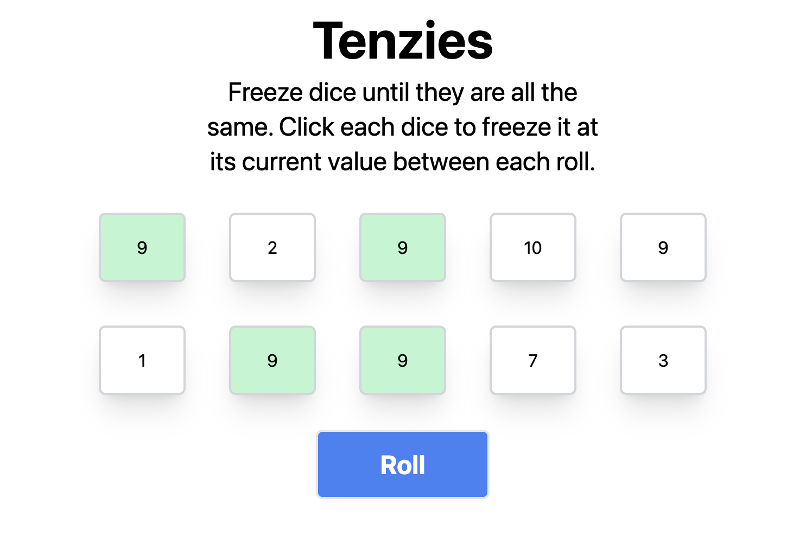

## Overview

The objective is to create a tenzies game using react. To win the game you must freeze all of the dice until they are the same number

## Preview

## Tools used

- Vite
- JS
- React
- CSS
- HTML
- TailwindCSS
- Netlify

## Lessons Learned

- How to handle state management with React
- UseEffect() and how to leverage actions after specific state changes occur
- Leveraging tailwindcss styling with React
- unique ways to use the map function in order to manipulate the dice objects
- The every javascript function
- Conditional rendering specific game instructions

## [Live Deployment](https://curious-sorbet-b80561.netlify.app/)
